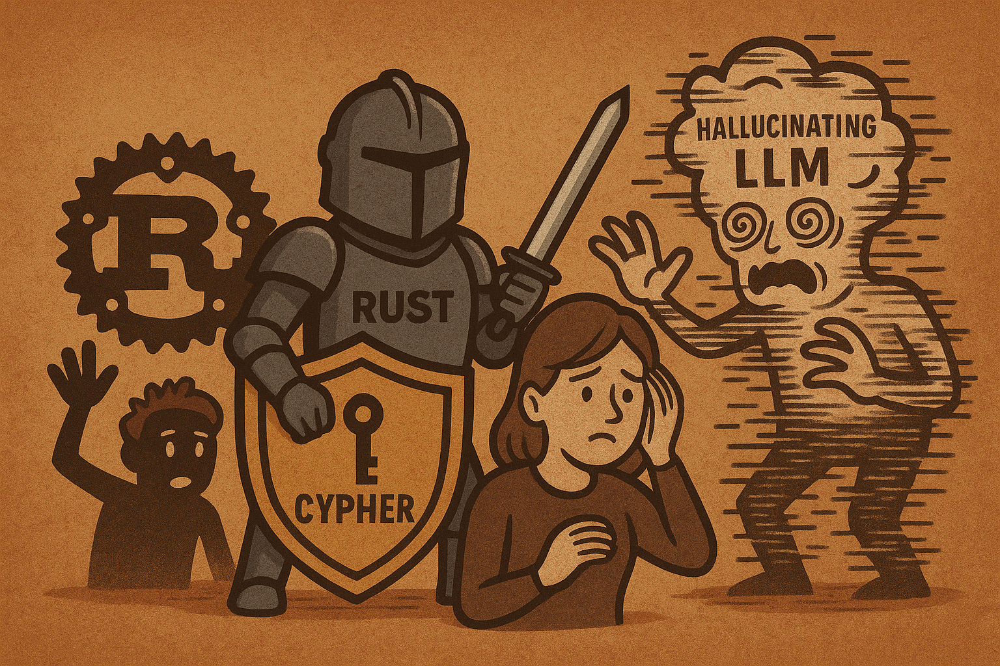

# cypher-guard



## Introduction

Cypher Guard is an open-source Rust library and CLI tool for parsing and validating [Cypher](https://neo4j.com/developer/cypher/) queries against a user-defined schema. It provides robust, schema-aware validation for graph queries, with bindings for Python and TypeScript/JavaScript. The Python and TypeScript/JS bindings expose a simple API in those languages, but leverage the full performance and safety of Rust under the hood. Cypher Guard is designed for use in developer tools, CI pipelines, and anywhere you need to ensure Cypher query correctness.

---

## Quickstart

### Rust

```sh
cargo build --release
```

### Python

```sh
# Install uv (if not already)
pip install uv

# Install dependencies from pyproject.toml
uv pip install -r pyproject.toml

# Build Python bindings
uv pip install maturin
maturin develop
```

### TypeScript/JavaScript

```sh
cd rust/js_bindings
npm install
npm run build
```

---

## Usage

### CLI

```sh
echo "MATCH (n:Person) RETURN n" | cargo run --bin cypher-guard
```

### Rust Library

```rust
use cypher_guard::validate_cypher_with_schema;
let schema = ...; // Load your schema
let query = "MATCH (n:Person) RETURN n";
let result = validate_cypher_with_schema(query, &schema);
```

### Python API

```python
from cypher_guard import validate_cypher, get_validation_errors

schema_json = '{...}'  # Your schema as JSON
query = "MATCH (a:Person)-[r:KNOWS]->(b:Person) RETURN a.name, r.since"

is_valid = validate_cypher(query, schema_json)
errors = get_validation_errors(query, schema_json)
```

### TypeScript/JavaScript API

```typescript
import { validateCypher, getValidationErrors } from "cypher-guard";

const schemaJson = '{...}';
const query = "MATCH (a:Person)-[r:KNOWS]->(b:Person) RETURN a.name, r.since";

const isValid = validateCypher(query, schemaJson);
const errors = getValidationErrors(query, schemaJson);
```

---

## Makefile Commands

The Makefile provides convenient shortcuts for building, testing, and linting across Rust, Python, and JavaScript/TypeScript bindings.

| Command         | Description                                                                 |
|-----------------|-----------------------------------------------------------------------------|
| `make` or `make build`         | Build and install the Python extension using Poetry and Maturin.      |
| `make poetry-install`          | Install Python dependencies for the bindings using Poetry.            |
| `make build-python`            | Build and install the Python extension (runs `poetry run maturin develop`). |
| `make test-python`             | Run the Python test suite with pytest.                                |
| `make build-js`                | Install and build the JS/TS bindings (`npm install && npm run build`).|
| `make test-js`                 | Run the JS/TS test suite (`npm test`).                                |
| `make build-rust`              | Build the Rust library (`cargo build`).                               |
| `make test-rust`               | Run Rust tests, formatting, and clippy lints.                        |
| `make fmt`                     | Check Rust code formatting (`cargo fmt --all -- --check`).            |
| `make clippy`                  | Run clippy linter on the main Rust crate.                             |
| `make clippy-all`              | Run clippy linter on all Rust crates.                                 |
| `make clean`                   | Remove build artifacts, Python caches, and node modules.              |
| `make install`                 | Alias for `make build`.                                               |

**Note:** Most commands are cross-platform and will set up all dependencies for you.

---

## How It Works: Parsing & Validation Flow

Cypher Guard separates query validation into two phases:

1. **Parsing**: Uses the [`nom`](https://docs.rs/nom) parser combinator library to convert Cypher into an Abstract Syntax Tree (AST). If parsing fails, you get a syntax error.
2. **Validation**: Traverses the AST and checks all labels, relationship types, and properties against your schema. Returns semantic errors if anything is missing or mismatched.

### File/Module Structure

- `parser/clauses.rs`: Top-level Cypher clauses (MATCH, RETURN, etc.)
- `parser/patterns.rs`: Node, relationship, and path pattern parsing
- `parser/ast.rs`: AST node definitions
- `schema.rs`: Schema structure and validation logic
- `errors.rs`: Error types and reporting
- `python_bindings/`, `js_bindings/`: Language bindings

---

## Features

- Full Cypher clause support: MATCH, OPTIONAL MATCH, RETURN, WITH, WHERE, CREATE, MERGE, SET
- Node/relationship patterns, QPPs, path variables, quantifiers, function calls, property types
- Schema-aware validation: labels, types, properties, direction, type checking, variable scoping
- Rust, Python, and TypeScript/JS bindings
- 190+ tests across all languages

---

## Supported Cypher Parsing Features

### Clauses
- `MATCH`, `OPTIONAL MATCH`
- `RETURN`
- `WITH` (aliases, property access, function calls, wildcards)
- `WHERE` (complex conditions, logical operators, parentheses)
- `CREATE`
- `MERGE` (with `ON CREATE` and `ON MATCH`)
- `SET`

### Node Patterns
- Basic nodes: `(n)`
- Labeled nodes: `(n:Person)`
- Nodes with properties: `(n:Person {name: 'Alice', age: 30})`
- Nodes with variables: `(person:Person)`

### Relationship Patterns
- Basic: `(a)-[r]->(b)`
- Typed: `(a)-[r:KNOWS]->(b)`
- With properties: `(a)-[r:KNOWS {since: '2020'}]->(b)`
- Variable length: `(a)-[r:KNOWS*1..5]->(b)`
- Optional: `(a)-[r:KNOWS?]->(b)`
- Undirected: `(a)-[r:KNOWS]-(b)`
- Multiple types: `(a)-[r:KNOWS|FRIENDS]->(b)`

### Quantified Path Patterns (QPP)
- Basic: `((a)-[r:KNOWS]->(b)){1,5}`
- With WHERE: `((a)-[r:KNOWS]->(b) WHERE r.since > '2020'){1,5}`
- With path variables: `p = ((a)-[r:KNOWS]->(b)){1,5}`

### WHERE Conditions
- Property comparisons: `n.name = 'Alice'`, `n.age > 30`
- Boolean: `n.active = true`, `n.name IS NULL`
- Function calls: `length(n.name) > 5`
- Path properties: `p.length > 2`
- Logical: `AND`, `OR`, `NOT`
- Parenthesized: `(n.age > 30 AND n.active = true)`

### Property Values
- Strings: `'Alice'`
- Numbers: `30`, `3.14`
- Booleans: `true`, `false`
- NULL: `NULL`
- Lists: `[1, 2, 3]`
- Maps: `{name: 'Alice', age: 30}`
- Function calls: `timestamp()`

### Function Calls
- Basic: `length(n.name)`
- Nested: `substring(n.name, 0, 5)`
- Multiple arguments: `coalesce(n.name, 'Unknown')`

### Quantifiers
- Zero or more: `*`
- One or more: `+`
- Exact: `{5}`
- Range: `{1,5}`
- Optional: `?`

### Path Variables
- Assignment: `p = (a)-[r:KNOWS]->(b)`
- Path properties: `p.length`, `p.nodes`, `p.relationships`

---

## Test Coverage
- **Rust**: 190+ tests covering parsing, validation, error handling, and edge cases
- **Python**: Unit tests for valid/invalid queries, QPPs, schema validation, and error reporting (`rust/python_bindings/tests/unit/`)
- **TypeScript/JS**: Tests for JS/TS bindings (`rust/js_bindings/test.ts`)

---

## Contributing

This project is open source and welcomes contributions! Please open issues or submit pull requests for improvements or bug fixes.

---

## License

MIT